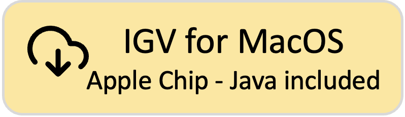
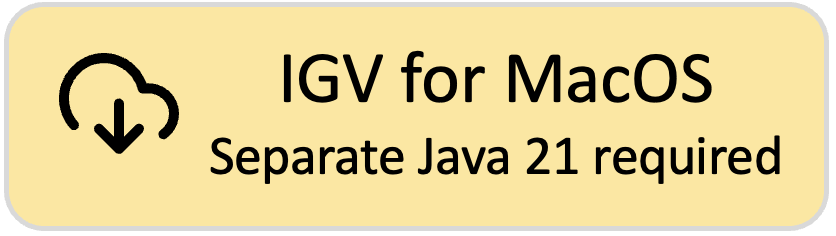
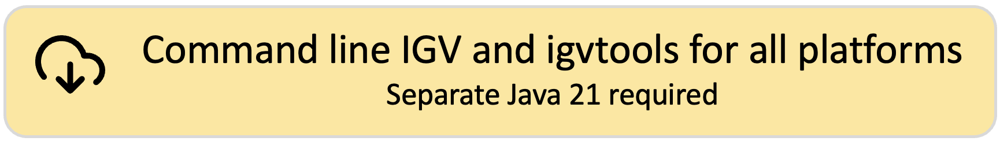

<!---
The page title should not go in the menu
-->

 Download IGV 

### IGV version 2.19.1

**What's New:** See the [Release Notes](ReleaseNotes/2.19.x.md) for what's new in each IGV release.

# All platforms

**IGV requires Java 21 or greater as of IGV 2.19.1**. If you download one of the IGV versions that does not include Java, make sure you have Java 21 installed and in your path.

**Mac users:** As of IGV 2.19.1, the IGV Mac apps require **MacOS 11 (Big Sur)** or greater.
 
* To run **the latest IGV** on older MacOS versions, download and use the ***Command line IGV for all platforms*** option from the main [Download page](https://igv.org/doc/desktop/#DownloadPage/). 
* To run **a working IGV Mac app** on older MacOS versions, download the [**2.18.4 Mac app**](https://data.broadinstitute.org/igv/projects/downloads/2.18/IGV_MacApp_2.18.4_WithJava.zip) (includes Java). Or load any IGV Mac app version 2.18.4 or earlier from the [IGV download archive](https://data.broadinstitute.org/igv/projects/downloads/).
 

**Linux users:** The *IGV for Linux* download includes AdoptOpenJDK (now Eclipse Temurin) version 21 for x64 Linux. See their list of supported platforms [here](https://adoptium.net/supported-platforms/). If your platform is not on the "x64 Linux" list, or the packaged Java does not work on your version of Linux, download the *"Command line IGV for all platforms"* and use it with your own Java installation.
  

[{height=80}](https://data.broadinstitute.org/igv/projects/downloads/2.19/IGV_MacApp_2.19.1_WithJava.zip)
[{height=80}](https://data.broadinstitute.org/igv/projects/downloads/2.19/IGV_MacAppIntel_2.19.1_WithJava.zip)
[{height=80}](https://data.broadinstitute.org/igv/projects/downloads/2.19/IGV_MacApp_2.19.1.zip)
 
[{height=80}](https://data.broadinstitute.org/igv/projects/downloads/2.19/IGV_Win_2.19.1-WithJava-installer.exe)
[{height=80}](https://data.broadinstitute.org/igv/projects/downloads/2.19/IGV_Win_2.19.1-installer.exe)
 
[{height=80}](https://data.broadinstitute.org/igv/projects/downloads/2.19/IGV_Linux_2.19.1_WithJava.zip)
 
[{height=80}](https://data.broadinstitute.org/igv/projects/downloads/2.19/IGV_2.19.1.zip)

# Other releases of IGV Desktop

**[Development snapshot build.](DownloadSnapshot.md)** Latest development snapshot; built at least nightly

**[Archived releases.](https://data.broadinstitute.org/igv/projects/downloads/)** Old releases going back to IGV 2.0

# Other versions of IGV

This Downloads page is for the IGV desktop version. See also:

- If you are looking for the IGV-Web application, see [https://igv.org/app](https://igv.org/app)
- If you are a developer looking for information about the embeddable igv.js component,
  see [https://github.com/igvteam/igv.js](https://github.com/igvteam/igv.js)
- If you are developer wanting to use igv.js in a notebook (Jupyter or Colab),
  see [https://github.com/igvteam/igv-notebook](https://github.com/igvteam/igv-notebook)
- To generate self-contained HTML reports that consist of a table of genomic sites and associated IGV views,
  see [https://github.com/igvteam/igv-reports](https://github.com/igvteam/igv-reports)

!!! tip " "
    Did you know that there is also an **IGV web application** that runs only in a web browser, does not use Java, and requires no downloads? See **[https://igv.org/app](https://igv.org/app)**. Click on the Help menu in the app for more information about using IGV-Web.

